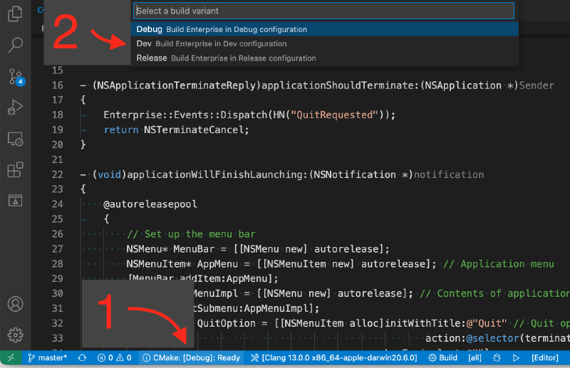
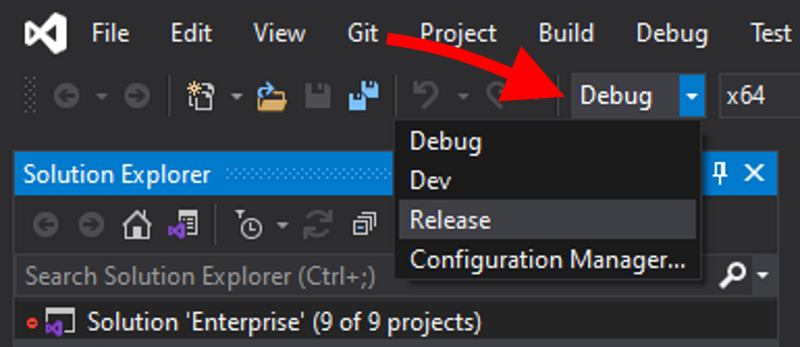
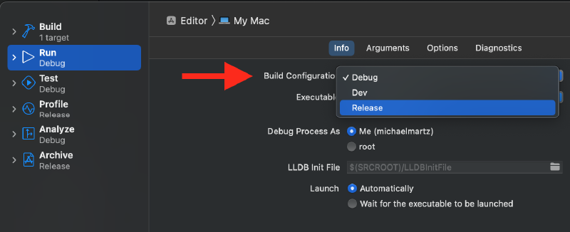

@page Programming Programmer Resources
@tableofcontents

Subpages:
* @subpage Assertions
* @subpage Console

---

There is more to programming in %Enterprise than learning its [system APIs](@ref Systems). This guide covers several tools and concepts that will be useful to you as an %Enterprise developer.

# Build Configurations

Out of the box, %Enterprise supports three different build configurations:

* **Debug**: Compiles unoptimized code, but with all assertions and debugging information enabled. Use this configuration to develop new features.
* **Dev**: Compiles optimized code with debugging information, but with expensive assertions disabled. Use this configuration to safely test code at near-Release speeds.
* **Release**: Compiles fully optimized code, but with debugging information and all assertions disabled. Use this configuration to build shipping programs.

When compiling %Enterprise, the selected build configuration will affect the speed and debuggability of the editor and engine library. Importantly, %Enterprise game projects are *themselves* built in Debug, Dev, or Release configuration, independent of %Enterprise. This means that if you are using a Release version of %Enterprise to develop your game, the engine code will always be optimized, even if you compile your game in Debug configuration.

## Selecting a configuration type

To select a configuration in Visual Studio Code with CMake Tools, you simply need to select the corresponding *variant*. To do this, run *CMake: Select Variant* from the Command Palette (*Ctrl/Cmd + Shift + P*), then choose Debug, Dev, or Release. Alternatively, you may click on the active configuration in the Status bar, then choose the variant name from the pop-up menu.



In Visual Studio, configurations are selected in the Solution Configurations dropdown, normally found below the menu bar:



In Xcode, use the Run tab of the Edit Scheme dialog to select the configuration:



If you are compiling %Enterprise using CMake on the command line, you can specify a configuration for single-config generators using `-DCMAKE_BUILD_TYPE`, and for multi-configuration generators using `--config`:

```{.bat}
# For a single-configuration generator
cmake -S . -B build -DCMAKE_BUILD_TYPE=[Debug|Dev|Release]

# For a multi-configuration generator
cmake --build build --config [Debug|Dev|Release]
```

# Conditional Compilation

In some cases, you may wish to conditionalize code depending on the build configuration. This can be done using the preprocessor symbols `EP_CONFIG_DEBUG`, `EP_CONFIG_DEV`, and `EP_CONFIG_RELEASE`.

```cpp
#ifdef EP_CONFIG_DEBUG

// Debug-only code here

#elif defined(EP_CONFIG_DEV)

// Dev-only code here

#elif defined(EP_CONFIG_RELEASE)

// Release-only code here

#endif
```

To compile code as Windows-only or Mac-only, use the generic preprocessor symbols `_WIN32`, `__APPLE__`, and `__MACH__`:

```cpp
#ifdef _WIN32

// Windows-only code here

#elif defined(__APPLE__) && defined(__MACH__)

// macOS-only code here

#endif
```

Note that `__APPLE__` may be defined on non-Mac platforms like iOS or iPadOS. For this reason, one should check for both `__APPLE__` *and* `__MACH__` when writing Mac-specific code, even though Enterprise does not presently support other Apple platforms.

@anchor Core_Calls
# Core Calls

As you learn %Enterprise, you will notice a few method names crop up again and again: *Init(), FixedUpdate(), Update(), Draw(),* and *Cleanup()*. These are known as the "core calls": functions whose names tell you exactly when they will be invoked. Core calls are used throughout %Enterprise to organize execution, and developers are encouraged to follow the paradigm when developing their own systems and classes.

The core calls are invoked as follows:

* **Init()** and **Cleanup()**: Called at the start and end of a class's lifecycle. These are not replacements for constructors and destructors: instead, they are used in situations where constructors and destructors are not suitable, such as static classes or [ring buffer objects](https://en.wikipedia.org/wiki/Circular_buffer).
* **FixedUpdate()**: Called every Constants::Time::FixedTimestep seconds, independent of the game's actual framerate. This is useful for complex simulations, such as physics simulations. Correct use of FixedUpdate can make your gameplay much more stable and deterministic, even across a wide variety of platforms.
* **Update()**: Called once every frame. Gameplay and UI code is often implemented here.
* **Draw()**: Called immediately after Update(). Rendering code lives here.

Core calls are invoked in a hierarchy. At the top of the hierarchy is Enterprise::Application, which invokes the core calls of each of %Enterprise's [core systems](@ref Systems) during Application::Run(). From there, the systems invoke the core calls of all their constituents, and the constituents do the same until the entire engine has been serviced.

As a developer, you will most commonly implement core calls when developing your own subsystems for [SceneManager](@ref SceneManager) or game states for [StateManager](@ref StateManager).

@see @ref Time
@see @ref SceneManager
@see @ref StateManager

# Assertions

In C++ development, [assertions](https://en.wikipedia.org/wiki/Assertion_(software_development)) are commonly employed to ensure programs never enter invalid states. Assertions are one of the most powerful tools available to developers: they serve as “bug landmines", potentially curbing huge issues before they have a chance to grow.

%Enterprise offers a variety of assertion macros that integrate well with its build configurations. See @ref Assertions for more information.

@see @ref Assertions

# Custom Command Line Options

By default, an executable made with %Enterprise supports the following command line options:

* **Help** ("-h", "--help"): Prints a list of command line options supported by the game.
* **Content Directory** ("-c", "--content-dir"): Specify a custom location for the game's content files.
* **Data Directory** ("-d", "--data-dir"): Specify a custom location to store application data.
* **Engine Shaders Directory** ("-e", "--engineshaders-dir"): Specify a custom location to store the %Enterprise-provided GLSL headers.

@note The *.vcxproj* and *.xcodeproj* files generated by Premake automatically pass `--content-dir`, `--data-dir`, and `--engineshaders-dir` arguments with suitable locations for debugging. For more information about this, refer to the [File system documentation](@ref File).

In some development scenarios, though, it may be helpful to define your own options. This can be done very easily using Application::RegisterCmdLineOption():

```cpp
void Game::Init()
{
    Application::RegisterCmdLineOption
	(
		"Example Option",
		{ "-e", "--example-opt" },
		"This is the description that shows up in the --help output.  It takes no arguments, so the next parameter should be 0",
        0
	);

    // Set up game systems, initial game state, etc
}
```

This must be done in Game::Init().

After an option is registered, you can use Application::CheckCmdLineOption() or Application::GetCmdLineOption() to respond to it. Use CheckCmdLineOption() to check for simple flags, and GetCmdLineOption() to check options that have additional parameters.

@note Application::CheckCmdLineOption() and Application::GetCmdLineOption() can be invoked at any time after Game::Init(), even during Update(), FixedUpdate(), or Draw(). The command line options are stored into a global hash table at application launch, and they remain available for lookup until the program terminates.

@see
@ref File

# Developer Console

Eventually, %Enterprise will feature a full in-game developer's console to aid in game development. This is pending the development of %Enterprise's [core systems](@ref Systems), but it will be documented in @ref Console when it is ready.

For now, %Enterprise only features logging to an external console window on Windows and to the Xcode terminal on Mac. More information about the current logging setup is available on the [console page](@ref Console).

@see @ref Console

# HashNames

%Enterprise employs a [hashing](https://en.wikipedia.org/wiki/Hash_function) system called HashNames to generate GUIDs. HashNames are 64-bit GUIDs generated deterministically from strings: basically, a way to turn a string into a unique number.

In situations where you need unique IDs, HashNames are an excellent choice, thanks to the following features:

* Systems can independently identify HashNames just by knowing their associated "friendly" names.
* HashNames can be compared far faster than string names can.
* HashNames are computable at compile time.
* HashNames can be used in `switch` cases.

Due to these benefits, many of %Enterprise's core system APIs take HashNames as function parameters. Here are some of the things that %Enterprise uses HashNames for:

* Event dispatching and identification
* Setting shader uniform values
* Tagging scene entities
* and more!

To generate a HashName, use the global function HN(). In **Debug** builds, this function hashes the string, performs collision detection, and interns the string for use in the [console](@ref Console). In **Dev** and **Release** builds, it simply performs a `constexpr` conversion without collision detection (at compile time, when possible):

```cpp
HashName identifier = HN("Unique stringname");
```

While HN() is the preferred way to generate HashNames, it can't be used in `case:` statements because the collision detection in **Debug** builds prevents it from being computable at compile-time. To use HashNames in `case:` statements, use @link operator ""_HN(const char*, size_t) ""_HN literals@endlink. This is a custom literal type which skips collision detection and string interning.

```cpp
switch (identifier)
{
case "Case 1"_HN:
    doThing1();
    break;
case "Case 2"_HN:
    doThing2();
    break;
default:
    doDefaultThing();
    break;
}
```

@note It is a best practice to use HN() instead of @link operator ""_HN(const char*, size_t) ""_HN@endlink when possible. While the odds of hash collisions are extremely low, the consistent use of HN() will protect you if and when one occurs.

@remarks HashNames are computed using [Compile-Time SpookyHash](https://github.com/theOtherMichael/CTSpookyHash).

# Hot Constants

%Enterprise features [Hot Constants](https://github.com/theOtherMichael/HotConsts), a software library that allows you to tweak hard-coded values live while debugging your apps.

To create a hot constant, use the HC() macro to declare it:

```cpp
HC(float, JumpHeight) = 5.0f;

void handlePlayerJump()
{
    playerPos.y += JumpHeight;
}

```

Once created, you can use the constant the same way you would any other. However, in **Debug** and **Dev** configurations, your game will now become responsive to live changes in the source code. If you modify a hot constant's value in the source while your game is running, it will automatically reload the new value when the file is saved. This is done by a background thread in a thread-safe way.

The Hot Constants reload mechanism only works in **Debug** and **Dev** builds. In **Release** builds, the HC() macro expands into a simple constant declaration, leaving truly hard-coded values in your final game.

@remarks To learn more about Hot %Constants, visit the [Hot Constants GitHub page](https://github.com/theOtherMichael/HotConsts).

@note Some of the constants in Enterprise::Constants are hot. This allows you to tweak some low-level engine values live.

# OpenGL Mathematics (GLM)

%Enterprise uses the [OpenGL Mathematics](https://glm.g-truc.net/0.9.9/) library, better known as *GLM*, for advanced math operations. Many API calls accept GLM types as parameters, including glm::quat, glm::vec, glm::mat. Developers are encouraged to take advantage of the library when performing 2D or 3D calculations.

# YAML-CPP

%Enterprise uses [yaml-cpp](https://github.com/jbeder/yaml-cpp) to read and write YAML files. This is primarily used in the reading and writing of Scene files in the %Enterprise editor, but developers may wish to use the library to read and write YAML files for their own purposes.

This library was considered robust enough that it is integrated directly in the %Enterprise API in some places. If you choose to develop new component types for SceneManager, your component serialization callbacks will receive YAML::Node references with which to read and write your component data.

@see
@ref SceneManager

# Miscellaneous "Nice-to-Haves"

%Enterprise also offers a few helper macros that are worth calling out:

* **BIT()**: A macro that allows you to rapidly assemble bit fields.
* **EP_DEBUGBREAK()**: A cross-platform way to trigger a breakpoint in the debugger. Used internally in assertion failures or other errors.
