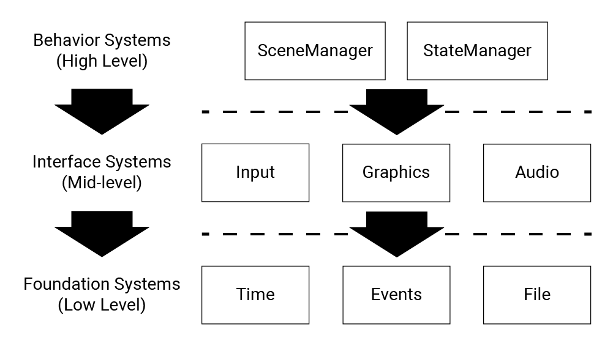

@page Systems Systems

Subpages:
* @subpage Events
* @subpage Time
* @subpage File
* @subpage Input
* @subpage Graphics
* @subpage Audio
* @subpage SceneManager
* @subpage StateManager

---

At the bedrock of %Enterprise is its systems.  %Enterprise's core systems are simultaneously APIs and automated data managers.  In other words, each system:

* Automatically handles low-level background tasks
* Fulfills requests made by other systems

At the time of this writing, eight systems are planned for development: [Events](@ref Events), [Time](@ref Time), [File](@ref File), [Input](@ref Input), [Graphics](@ref Graphics), [Audio](@ref Audio), [SceneManager](@ref SceneManager), and [StateManager](@ref StateManager).  These systems often depend on each other, resulting in the dependency hierarchy shown below:

@remarks To support networked games, I may eventually add a fourth foundation system called *Network*.  At the the time of this writing, however, this is not on the roadmap.

The actual relationship between these systems is a little more complicated than this graph may suggest.  For example, the [Events](@ref Events) system frequently passes data *up* to higher layers, and even does so on behalf of other higher systems.  In general, though, each system is unaware of the systems in the layers above.
