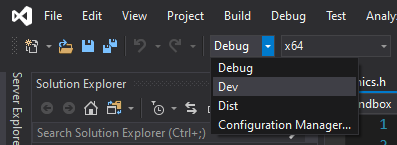
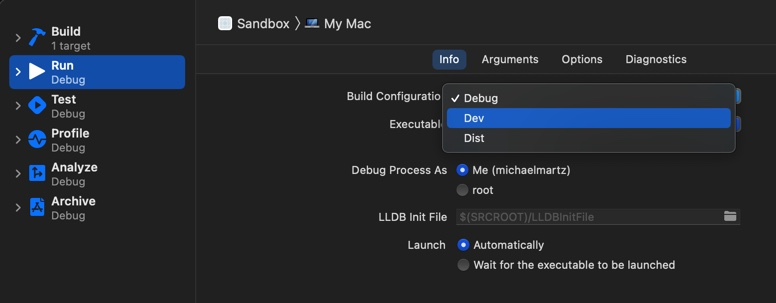

@page Programming Programmer Resources
@tableofcontents

#### Subpages
* @subpage Assertions
* @subpage Console

---

There is more to programming in %Enterprise than learning its [system APIs](@ref Systems).  This guide covers several tools and concepts that will be useful to you as an %Enterprise developer.

# Concepts

## Build Configurations

When developing with %Enterprise, you have access to three different build configurations:

* **Debug**: Compiler optimizations are disabled, all assertions are enabled, and debug symbols are turned on.  This is the slowest configuration, but the best one for testing new code and debugging.
* **Dev**: Short for "Development".  Compiler optimizations are enabled, slow assertions are disabled, and debug symbols are on.  Good for testing your game at representative speeds while still offering some debugging capabilities.
* **Dist**: Short for "Distribution".  Compiler optimizations are enabled, all assertions are disabled, and debug symbols are off.  This is equivalent to a "Release" build: use this configuration when compiling the shipping version of your game.

You can change configurations using the Solution Configurations dropdown of Visual Studio, or in the Edit Scheme dialog of Xcode:




You can conditionalize code to run on specific builds by watching for the following defines:

* **EP_CONFIG_DEBUG**
* **EP_CONFIG_DEV**
* **EP_CONFIG_DIST**

%Enterprise does not use custom defines to differentiate between Mac and Windows.  Instead, developers are encouraged to watch for the native defines `_WIN32`, `__APPLE__`, and `__MACH__` when writing platform-specific code.  For example:

```cpp
#ifdef _WIN32

// Windows-only code here

#elif defined(__APPLE__) && defined(__MACH__)

// macOS-only code here

#endif
```

@see @ref Assertions

## Core Calls

As you learn %Enterprise, you will notice a few method names crop up again and again: *Init(), Tick(), Update(), PhysUpdate(), Draw(),* and *Cleanup()*.  These are the "core calls": functions that are invoked at specific times during the application lifecycle.  Core calls are used throughout %Enterprise to organize execution, and developers are encouraged to follow the paradigm when developing their own classes and systems.

The core calls are invoked as follows:

* **Init()** and **Cleanup()**: Called at the start and end of a class's lifecycle.  These are not replacements for constructors and destructors: instead, they are used in situations where constructors and destructors are not suitable, such as managing the lifecycle of [ring buffer](https://en.wikipedia.org/wiki/Circular_buffer) objects.
* **Tick()**: In %Enterprise, a "tick" occurs at the start of each frame and each physics frame.  Every call to Application::Run() triggers at least one Tick(), so ticks happen very, very frequently.
* **Update()**: Called once every frame.  Gameplay code is typically implemented here.
* **PhysUpdate()**: Called once every physics frame, which occurs at a fixed timestep.  Physics simulations are updated here.
* **Draw()**: Called immediately after Update().  Rendering code lives here.

@note At the time of this writing, Tick() is not used for anything besides timing physics frames.  It will be removed from this list in the future if it remains unused.

Core calls are invoked in a hierarchy.  At the top of the hierarchy is Enterprise::Application, which invokes the core calls of each of %Enterprise's [core systems](@ref Systems) during Application::Run().  From there, the systems invoke the core calls of all their constituents, and the constituents do the same until the core calls have fully propagated throughout the engine.

As a developer, you will most commonly implement core calls when developing your own subsystems for ECS, or game states for StateManager.  For more information about ECS and StateManager, check out their system pages.

@see @ref ECS
@see @ref StateManager
@see @ref Time

# Tools

## Assertions

In C++ development, [assertions](https://en.wikipedia.org/wiki/Assertion_(software_development)) are commonly employed to ensure programs never enter invalid states.  Assertions are one of the most powerful tools available to developers: they serve as “bug landmines", potentially curbing huge issues before they have a chance to grow.

%Enterprise offers a variety of assertion macros that integrate well with its build configurations.  See @ref Assertions for more information.

@see @ref Assertions

## HashNames

%Enterprise employs a [hashing](https://en.wikipedia.org/wiki/Hash_function) system called HashNames to generate GUIDs.  HashNames are 64-bit GUIDs generated deterministically from strings: basically, a way to associate a string with a unique number.

In situations where you need unique IDs, HashNames are an excellent choice, thanks to the following features:

* Unrelated systems can reference the same HashNames by knowing only their "friendly" names.
* HashNames are just integers, making comparison very fast.
* HashNames are computable at compile time and can be used in `switch` cases.
* HashNames are automatically translated into their associated friendly names when logged to the [developer console](@ref Console).

Due to these benefits, many of %Enterprise's core system APIs take HashNames as function parameters. Here are some of the things that %Enterprise uses HashNames for:

* Differentiating event types
* Identifying shader uniforms
* Tagging ECS entities
* and more!

To generate a HashName, use the global function HN().  In **Debug** builds, this hashes the string, performs collision detection, and interns the string for use in error messages.  In **Dev** and **Dist** builds, the function simply performs a `constexpr` conversion without collision detection.

```cpp
HashName identifier = HN("Unique stringname");
```

While HN() is the preferred way to generate HashNames, it isn't suitable for `switch` cases because it is not `constexpr` in all builds.  However, you *can* use HashNames in `switch` cases by using @link operator ""_HN(const char*, size_t) ""_HN literals@endlink.  This custom literal type always hashes the string at compile time (including in debug builds), making it suitable for `switch` cases:

```cpp
switch (identifier)
{
case "Case 1"_HN:
    doThing1();
    break;
case "Case 2"_HN:
    doThing2();
    break;
default:
    doDefaultThing();
    break;
}
```

@note It is a best practice to use HN() instead of @link operator ""_HN(const char*, size_t) ""_HN@endlink whenever possible: while the odds of hash collisions are extremely low, the consistent use of HN() will protect you if and when one occurs.

@remarks HashNames are computed using [Compile-Time SpookyHash](https://github.com/theOtherMichael/CTSpookyHash).

## Hot Constants

%Enterprise features [Hot Constants](https://github.com/theOtherMichael/HotConsts), a software library that allows you to tweak hard-coded values live while debugging your apps.

To create a hot constant, use the HC() macro to declare it:

```cpp
HC(float, JumpHeight) = 5.0f;

if (playerPressedJump == true)
{
    playerPos.y += JumpHeight;
}

```

Once created, you can use the constant the same way you would any other.  However, in **Debug** and **Dev** configurations, your game will now become responsive to live changes in the source code.  If you modify a hot constant's value in the source while your game is running, it will automatically reflect the new value when the file is saved.  This is done by a background thread in a thread-safe way.

The Hot Constants reload mechanism is available in **Debug** and **Dev** builds only.  In **Dist** builds, the HC() macro expands into a simple constant declaration, leaving only hard-coded values in your final game.

@remarks To learn more about Hot Constants, visit the [Hot Constants GitHub page](https://github.com/theOtherMichael/HotConsts).

@note Some of the values in Enterprise::Constants are hot.  This allows you to tweak some low-level engine values live.

## Math Library

For vector and matrix manipulation, %Enterprise uses a custom math library.  While it is not as robust as a third-party solution, it is sufficient for the majority of game development scenarios and will continue to grow as the engine does.

Developers are encouraged to use Enterprise::Math wherever they use vectors and matrices in their games.

@see @ref Enterprise::Math
@see @ref Graphics
@see @ref ECS

## Custom Command Line Options

By default, an executable made with %Enterprise supports the following command line options:

* **Help** ("-h", "--help"): Prints a list of command line options supported by the game.
* **Content Directory** ("-c", "--content-dir"): Specify a custom location for the game's content files.
* **Data Directory** ("-d", "--data-dir"): Specify a custom location to store application data.

It is very easy to add more command line options to this list.  To register a new command line option, simply call @link Enterprise::Application::RegisterCmdLineOption() Application::RegisterCmdLineOption()@endlink during @link Enterprise::Game::Init() Game::Init()@endlink:

```cpp
void Game::Init()
{
    Application::RegisterCmdLineOption
	(
		"Example Option",
		{ "-e", "--example-opt" },
		"This is the description that shows up in the --help output.  It takes no arguments, so the next parameter should be 0",
        0
	);

    // Set up game systems, initial game state, etc
}
```

After an option is registered, you can use @link Enterprise::Application::CheckCmdLineOption() Application::CheckCmdLineOption()@endlink or @link Enterprise::Application::GetCmdLineOption() Application::GetCmdLineOption()@endlink to respond to it when it is provided.  Use the former when you are not expecting option arguments, and the latter when you are.

@note While @link Enterprise::Application::RegisterCmdLineOption() RegisterCmdLineOption()@endlink should be invoked during @link Enterprise::Game::Init() Game::Init()@endlink, @link Enterprise::Application::CheckCmdLineOption() CheckCmdLineOption()@endlink and @link Enterprise::Application::GetCmdLineOption() GetCmdLineOption()@endlink can be used at any time afterward, even during Update(), PhysUpdate(), or Draw().  This is because all command line options are stored into a global hash table at application launch, which remains available until program termination.

## Developer Console

Eventually, %Enterprise will feature a full in-game developer's console to aid in game development.  This is pending the development of %Enterprise's [core systems](@ref Systems), but it will be documented in @ref Console when it is ready.

For now, %Enterprise only features logging to an external console window on Windows and to the Xcode terminal on Mac.  More information about the current logging setup is available on the [console page](@ref Console).

@see @ref Console

## Miscellaneous "Nice-to-Haves"

%Enterprise also offers a few helper macros that are worth calling out:

* **BIT()**: A macro that allows you to rapidly assemble bit fields.
* **EP_DEBUGBREAK()**: A cross-platform way to trigger a breakpoint in the debugger.  Used internally in assertion failures or other errors.
