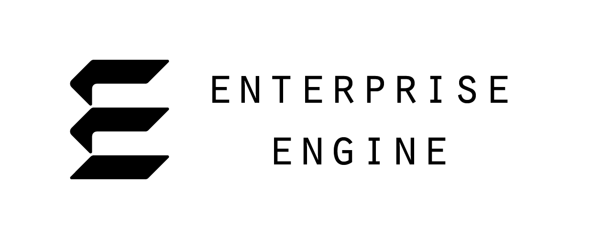

# Enterprise Engine
Enterprise is a "pet project" game engine I'm developing in C++ in my free time. I'm building it for these reasons:
* Because.
* To learn more about game engines.
* To push my C++ knowledge, and my programming skills overall.
* To practice integrating audio middleware, such as FMOD and Wwise.
* To serve as a testbed for developing new technologies or game ideas.
* (Eventually) I'll probably use it to push out a few indie games, too.

This project is still in its early stages (I only started working on it in December 2019), but it's now at a point where I figured I'd open it up for people to see.  A person can download and build the current version of Enterprise to see what I've done, or to get ideas for their own projects.  And while I certainly don't expect it, other developers can contribute to the project as well.

## Getting started
Use Git to clone the repository:

`git clone --recurse-submodules https://github.com/theMartzSound/Enterprise.git`

Note that this repository makes use of submodules, so don't forget to use `--recurse-submodules`.  If you do forget, your local repository will be missing files, and Enterprise will fail to build.

To build a solution for Visual Studio 2019, run "pm_Win32_VS2019.bat" in the _Scripts folder.  You should then be able to compile immediately.  Older versions of Visual Studio have not been tested and are not supported.  MacOS and Xcode support have not yet been added.

## Current State of Development
So far, I have developed Enterprise's low-level framework.  The framework consists of an entry point, a logging system, creation of a game window, custom assertions and exceptions, and a place to add new systems.  It's being developed with portability in mind, though for now, it is only for Windows.

### The Plan

Enterprise's basic systems are the current focus of development.  I'm developing these in pretty much the order you see below:

1. Time System (Done)
2. Event System (Done (mostly))
3. File System (In Development)
4. Input
5. Graphics
6. Audio
7. ECS
8. StateStack

Once the systems are done, then technically, Enterprise will be a fully-featured game engine.  However, even after the systems themselves are fully-featured, there are still a few other objectives to shoot for:

* An installation package generator
* Viewers/editors for asset creation
* Support for macOS and developement in Xcode
* Support for web players
* A network system
* Online store integration (Steam, etc.)

These goals are "nice to haves", but if Enterprise is ever used on a commercial project, they'd certainly help.

## Libraries Used
* Premake: <https://premake.github.io/>
* Spdlog: <https://github.com/gabime/spdlog>
* Cxx-prettyprint: <http://louisdx.github.io/cxx-prettyprint/>