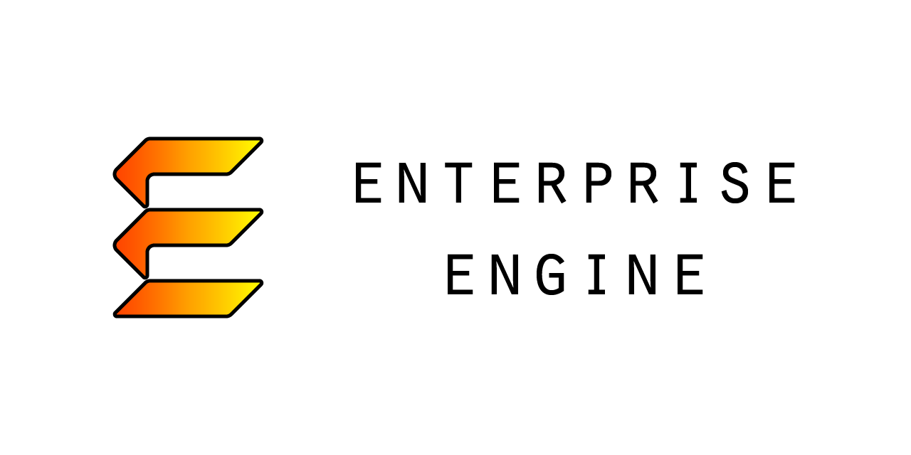

# Enterprise Engine
Enterprise is a "pet project" game engine I'm developing for Windows and macOS in my free time. I'm building 
it for these reasons:
* Because.
* To learn more about game engines.
* To push my C++ knowledge, and my programming skills overall.
* To practice integrating audio middleware, such as FMOD and Wwise.
* To serve as a testbed for developing new technologies or game ideas.

The engine is written in C++17.  Feel free to clone the project and build on it, or use it as a point of 
reference in your own projects.

## Build Instructions
1. Use Git to clone the repository with `--recurse-submodules` set.  If you're cloning with HTTPS, your 
script should look similar to the following:

    `git clone --recurse-submodules https://github.com/theOtherMichael/Enterprise.git`

2. In *_scripts*, run the script file for your platform to build your project files.
    * Windows: **pm_Win32_VS2019.bat**
    * macOS: **pm_Mac_XCode11.command**

3. In the root directory, open the newly generated `.sln` file (Visual Studio) or `.xcworkspace` file (Xcode) 
and build it.

The build system supports Visual Studio and XCode: there are no plans to support additional environments at this time.

### Windows Developers
Ensure you have installed the Windows 10 SDK prior to compiling.  It can be installed in the optional components of the 
Visual Studio 2019 Installer, or as a direct download [here](https://developer.microsoft.com/en-us/windows/downloads/windows-10-sdk/).

### Mac Developers
Mac users must additionally give Premake [permission to run](https://support.apple.com/guide/mac-help/open-a-mac-app-from-an-unidentified-developer-mh40616/mac) 
before the XCode build script will work correctly.  To do this, right-click **premake5** in the *_vendor/premake* 
folder, then select *Open > Open*.  Then, do the same for **pm_Mac_XCode11.command** during Step 2 of the build instructions.

## Documentation Generation
Enterprise features Doxygen documentation.  If you have installed Doxygen on your system, you can generate HTML 
documentation by running the appropriate script in `_scripts`:
* Windows: **gendocs_Win32.bat**
* macOS: **gendocs_Mac.command**

The generated documentation will appear in the root folder under `docs`.  Note that the script requires Doxygen to be 
installed in the default location for your platform (*"Program Files/doxygen"* for Windows and *Applications* for Mac), 
and that Mac users first need to give the script [permission to run](https://support.apple.com/guide/mac-help/open-a-mac-app-from-an-unidentified-developer-mh40616/mac).

Doxygen can be downloaded at <https://www.doxygen.nl/download.html>.

## Current State of Development
* The `Time` system (done\*)
* The `Events` system (done\*)
* The `File` system (done\*)
* The `Input` system (done\*)
* The `Graphics` system (done\*)
* The `SceneManager` system (done\*)
* The `StateManager` system (done\*)
* Enterprise editor (**up next**)
* Script components
* The `Audio` system

\* = good enough to move on from.

At this point, all of Enterprise's core systems, except for Audio, have MVP's.  The next big goal is to put 
together the Enterprise editor, which will allow the creation of much more robust systems and content.

## APIs Used
### Windows
* Win32
* Raw Input (for low-level keyboard/mouse input)
* XInput (for gamepad input)
* OpenGL (DirectX support coming later)

### macOS
* Cocoa
* Game Controller Framework (for gamepad input)
* OpenGL (Metal support coming later)

## Libraries Used
* Premake: <https://premake.github.io/>
* Spdlog: <https://github.com/gabime/spdlog>
* Cxx-prettyprint: <http://louisdx.github.io/cxx-prettyprint/>
* Compile-Time SpookyHash: <https://github.com/theOtherMichael/CTSpookyHash>
* Hot Constants: <https://github.com/theOtherMichael/HotConsts>
* Glad: <https://glad.dav1d.de/>
* stb_image: <https://github.com/nothings/stb>
* yaml-cpp: <https://github.com/jbeder/yaml-cpp>
* OpenGL Mathematics (GLM): <https://github.com/g-truc/glm>
* Multi-channel signed distance field atlas generator (msdf-atlas-gen): <https://github.com/Chlumsky/msdf-atlas-gen>
