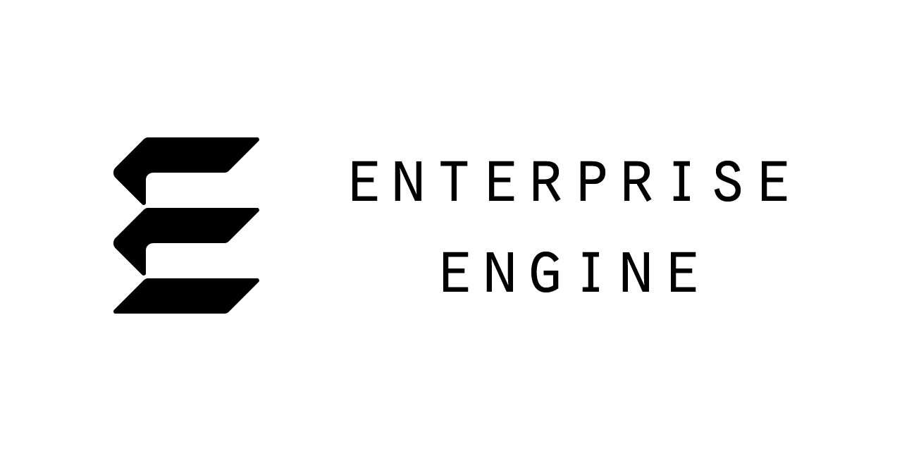

# Enterprise Engine
Enterprise is a "pet project" game engine I'm developing in C++ in my free time. I'm building it for these 
reasons:
* Because.
* To learn more about game engines.
* To push my C++ knowledge, and my programming skills overall.
* To practice integrating audio middleware, such as FMOD and Wwise.
* To serve as a testbed for developing new technologies or game ideas.

This project is still in its early stages (I only started working on it at the end of December 2019), 
but it's at a point now where I figured I'd make my efforts public. Feel free to clone the project to see 
what I've done, and if you're so inclined, you are welcome to contribute as well.

## Getting started
1. Use Git to clone the repository with `--recurse-submodules` set.  If you're cloning with HTTPS, your 
script should look similar to the following:

    `git clone --recurse-submodules https://github.com/theMartzSound/Enterprise.git`

2. In *_scripts*, run the script file for your platform to build your project files.
    * Windows: **pm_Win32_VS2019.bat**
    * macOS: **pm_Mac_XCode11.command**
3. In the root directory, open the newly generated `.sln` file (Visual Studio) or `.xcworkspace` file (Xcode) 
and build it.

At present, only Visual Studio 2019 (Windows) and Xcode 11 (macOS) have been tested.  I have no plans to 
add support for other compilers or platforms.

### For Visual Studio Users

Ensure you have installed the Windows 10 SDK.  It can be installed in the optional components of the Visual Studio 2019 Installer, or as a direct download [here](https://developer.microsoft.com/en-us/windows/downloads/windows-10-sdk/).

### For Xcode Users

Enterprise uses [Premake](https://premake.github.io/) to generate project files.  At present, Premake does 
not support custom Xcode schemes.  A default scheme is set up for building the Enterprise library and a test
Sandbox application.

Eventually, I will set up a build system for schemes, but for now, I recommend making the following manual 
tweaks to the default "Sandbox" scheme:
* Set **Run -> Options -> Console** to **Use Terminal**.  Xcode's built-in console does not support colored
  text.
* In **Run -> Arguments -> Environmental Variables**, set `OS_ACTIVITY_MODE = disable`.  This disables
  OS-level logging.

## Current State of Development
So far, I have developed Enterprise's framework as well as two of its core systems. The framework contains 
an entry point, a logging system, basic game window handling, custom assertions and exceptions, and a place 
to add systems. The development of the core systems is ongoing.

Enterprise supports Windows and macOS.  Linux support is not being considered at this time.

### The Plan

With the framework largely done, Enterprise's core systems are the focus of development. The systems are 
the following:

1. Time (done)
2. Events (done*)
3. File (in progress)
4. Input (in progress)
5. Graphics
6. Audio
7. ECS
8. StateStack (probably going to be renamed a few times)

### Extras
Once the core systems are finished, then technically, Enterprise will be, too. However, there are some 
goals I'd like to eventually meet, even if they aren't a high priority:

* An installation package generator
* Viewers/editors for asset creation
* Support for Linux and web players
* Online store integration (Steam, etc.)
* A Network system

## Libraries Used
* Premake: <https://premake.github.io/>
* Spdlog: <https://github.com/gabime/spdlog>
* Cxx-prettyprint: <http://louisdx.github.io/cxx-prettyprint/>
* Compile-Time SpookyHash: <https://github.com/theOtherMichael/CTSpookyHash>
* Hot Constants: <https://github.com/theOtherMichael/HotConsts>
